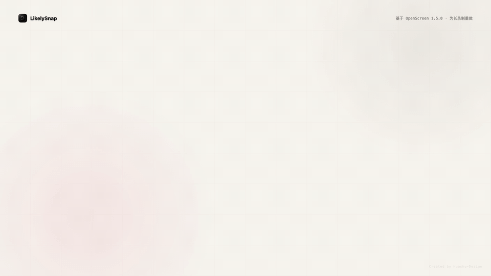

# LikelySnap

不是换皮，是底层重做。LikelySnap 基于 OpenScreen 1.5.0 改造而来，录制、编辑、导出三条主线全部换成全新架构，目标很简单：让长录制也能安心录、正常打开、继续编辑、顺利导出。

## 这个项目是怎么来的

事情一开始非常朴素。

我下载了原版 OpenScreen，心想：这个东西看着不错啊，界面干净，能录屏，能剪，还能做 zoom。于是我兴致勃勃地开录，认认真真录了差不多 40 分钟。

录完以后，我点击停止。

然后，文件没了。

不是说文件损坏了，不是说打不开，也不是说在哪里藏了一个临时文件等我去救。是真的找不到。桌面没有，下载没有，默认目录没有，翻来翻去没有。我甚至开始到处找残留文件，想着哪怕给我留个半截也行。

结果连残留都没有。

那一刻就很离谱。40 分钟的录制，不是 40 秒。人坐在那里讲了半天，鼠标点了半天，东西演示了半天，最后软件跟我说：没有。像什么都没发生过。

我当时真的火大。

所以这个项目不是因为“想做一个新皮肤”，也不是因为“想改个名字发新版”。LikelySnap 是被那次 40 分钟录制消失逼出来的。

我不想要一个短视频玩具。我想要的是：录得久一点也别炸，录完之后文件真的在，打开项目还能剪，摄像头、声音、鼠标都能对上，最后导出时也别把电脑吃死。

于是，我直接把原版从底层开始重构了一遍。

## 最重要的升级：录制、编辑、导出全新架构

LikelySnap 这次最大的变化，不是换了名字，不是改了颜色，也不是往界面上多塞几个按钮。

真正的变化是：录制、编辑、导出，三段全部换成了新的处理方式。

原版的思路更像“小工具”：录一段，停下来，软件再努力把东西收拾好。短视频还行，一旦录制变长，就容易出事。几十分钟、一小时、甚至更久的视频，不应该靠“内存硬扛”和“最后一刻保存”来赌命。

LikelySnap 现在做的是另一套思路：把一次录制当成一个真正的项目来处理。

Premiere Pro、DaVinci Resolve、剪映这类软件为什么能剪很长的视频、多条轨道、音频波形、预览缓存、导出队列？核心不是它们有魔法，而是它们不会傻乎乎地把所有素材一次性塞进内存里。它们会把素材当成“项目”来管理：文件在磁盘上，时间线按需读取，波形和预览可以缓存，重活放到后台，导出时一边处理一边写文件。

LikelySnap 现在就是往这个方向重做。

不是“录完生成一个视频就结束”，而是把屏幕、摄像头、声音、鼠标轨迹、项目信息放进同一个 `.likelysnap` 项目包里。这个项目包可以移动，可以重新打开，可以继续编辑，也更容易做恢复。

打开编辑器时，也不再一口气把所有东西全吞进去，而是先让你看到画面、拖动时间线、开始操作，再逐步准备波形、鼠标预览、自动 zoom 等重数据。长视频第一次打开仍然需要准备，但目标不是让你对着一个假死窗口干等，而是尽快把项目交还给你。

导出也一样。长视频导出不应该是“先憋一个巨大文件在内存里，最后再保存”。LikelySnap 改成边处理边写文件，成功后再交给你最终 MP4。

这就是为什么我说它不是换皮。

它是把原版最容易在长录制场景里翻车的底层流程拆开，重做，再接回去。录制不再赌最后一秒，编辑不再硬吞整段视频，导出不再把整条片子憋在内存里。这才是 LikelySnap 最核心的升级。

### 录制换了

录制过程中就持续写文件，不再把希望全部押在最后点击停止那一秒。

你录屏幕、麦克风、系统声音、摄像头、鼠标轨迹，这些东西都会尽量作为一个项目持续保存，而不是录完后才临时拼命整理。

这意味着长录制的安全感完全不一样：不是录了一个小时以后才开始祈祷软件别炸，而是从录制开始就不断留下可检查、可移动、可继续处理的文件。

### 编辑换了

编辑器不再把长视频当成一个必须一次性吃完的怪物。

它会先打开项目，让你尽快进入时间线。波形、鼠标数据、自动 zoom 建议这些比较重的东西，可以后台准备。长录制第一次打开仍然需要时间，但目标是“能操作地等待”，不是“卡住地等待”。

这也是它更接近成熟剪辑软件的地方：时间线应该是入口，素材和缓存应该围着时间线服务，而不是让用户先等软件把所有东西都算完。

### 导出换了

导出不再走那种容易吃爆内存的老路。

LikelySnap 会把画面处理后持续写入临时文件，确认成功后再变成最终文件。这个思路更接近正经剪辑软件处理长视频的方式：不要把整个结果憋在内存里赌运气，而是让文件一点点安全落地。

对用户来说，区别很直接：长视频导出应该像一个稳定的生产流程，而不是一次巨大的赌博。

## LikelySnap 到底改了什么

一句话：原版更像适合短录制的小工具，LikelySnap 往长录制、可恢复、可继续编辑的方向重做了。

### 1. 录制不再只赌最后一刻

以前最让人崩溃的是：录了很久，最后点停止，才发现前面全白忙。

LikelySnap 改成录制过程中就持续把关键文件写出来。也就是说，它不是等你录完才突然开始整理一大坨东西，而是边录边落盘，尽量让你的录制过程留下真实文件。

这不代表你可以随便断电乱杀进程，但它至少不再是那种“最后一步失败，前面全没了”的恐怖体验。

### 2. 每次录制都是一个项目包

LikelySnap 会把一次录制保存成一个 `.likelysnap` 文件夹。你可以把它理解成“这次录制的项目包”。

里面通常会有：

```text
recording-xxxx.likelysnap/
  screen.mp4
  webcam.mp4
  cursor.json
  manifest.json
```

普通用户不用理解这些文件名。你只要知道：屏幕视频、摄像头、鼠标轨迹、项目信息都放在同一个包里。

所以它更容易移动，也更容易恢复。你把整个 `.likelysnap` 包挪到别的地方，它还是应该能打开。

### 3. 长视频打开不应该把软件卡死

原版在长录制面前很容易露怯：东西越大，打开编辑器越痛苦。

LikelySnap 改了打开项目的方式。它会优先让你进入编辑器，先看到视频，先能拖时间线，先能操作。其他比较重的东西，比如波形、鼠标数据、自动 zoom 建议，可以在后面慢慢准备。

第一次打开很长的视频，仍然可能要等一下。比如几十分钟甚至几小时的录制，软件还是需要时间读信息、建缓存、准备预览。

但重点是：它不应该像以前那样直接卡死，或者把所有东西一股脑塞进内存里硬扛。

### 4. 摄像头、声音、鼠标要跟得上

录屏工具最烦人的情况之一是：画面是画面，摄像头是摄像头，声音是声音，鼠标又是另一套东西。短视频还好，一长就容易出错。

LikelySnap 把这些东西当成同一个项目来处理。

它会保存鼠标轨迹，支持后面继续编辑鼠标效果。它也会尽量保证摄像头和主屏幕视频在同一条时间线上。你后面做 zoom、跟随鼠标、导出视频时，这些东西不应该各跑各的。

### 5. 自动 zoom 不再只是傻放大

LikelySnap 保留并强化了自动 zoom。

你可以让它根据鼠标行为生成 zoom 片段，也可以单独调整每个 zoom 片段。需要跟随鼠标的地方，可以跟；不需要跟随的地方，就保持稳定，避免画面一直晃。

简单说：自动生成只是起点，不是判死刑。你后面还能改。

### 6. 导出不再把整段视频憋在内存里

长视频导出最怕什么？怕软件一边导出一边把内存吃满，最后电脑风扇狂转，软件假死，导出失败。

LikelySnap 的 MP4 导出已经改成更适合长视频的方式：边处理，边写文件。它会先写到临时文件，成功后再变成最终文件。

这比“全部憋在内存里，最后一次性保存”靠谱得多。

## 现在能做什么

LikelySnap 现在主要面向这些场景：

- 录制教程、演示、课程、产品说明
- 一次录制几十分钟甚至更久
- 同时录屏幕、麦克风、系统声音、摄像头
- 后期继续调整鼠标效果和 zoom
- 剪掉废话片段，保留重点内容
- 导出 MP4 或 GIF

当前支持的能力包括：

- 屏幕录制和窗口录制
- 麦克风录制
- 系统声音录制
- 摄像头录制
- 鼠标轨迹保存和后期编辑
- 自动 zoom 建议
- 单个 zoom 片段开启或关闭鼠标跟随
- 长视频波形缓存
- 视频剪辑、裁剪、变速、背景、注释、模糊、字幕
- MP4 和 GIF 导出
- macOS 和 Windows x64

## 和原版 OpenScreen 的区别

LikelySnap 不是从零开始的新项目。它基于 OpenScreen 1.5.0 改造而来。

OpenScreen 的优点是：想法好，界面轻，录屏后能快速做一点编辑，对短录制很友好。

但我遇到的问题是：一旦录制时间变长，它就不够稳。长录制需要的不是“看起来能录”，而是每一步都要尽量可恢复、可继续、可验证。

LikelySnap 主要改在这些地方：

- 从“短录制优先”改成“长录制优先”
- 从“停止后再处理一大坨”改成“录制中持续写文件”
- 从“普通视频文件”改成“完整项目包”
- 从“打开时一次性硬加载”改成“先能操作，再慢慢准备重数据”
- 从“自动 zoom 生成了就算了”改成“每个 zoom 片段还能单独调”
- 从“导出容易吃内存”改成“边处理边写文件”
- 增加独立设置界面，录制位置、项目位置、缓存位置、画质、帧率、码率都能设置

## 长录制说明

LikelySnap 的方向是让长录制更可靠，但长录制本身就是重活。

如果你录了 30 分钟、1 小时、甚至更久，第一次打开项目时，软件可能需要一点时间准备数据。比如生成波形、读取视频信息、准备鼠标预览、生成 zoom 建议。

所以你可能还是会看到几秒到几十秒的等待。区别在于：这个等待应该是“软件在准备”，而不是“软件已经炸了”。

## 当前边界

这个项目还在继续打磨。现在需要诚实说清楚：

- 很长的视频第一次打开仍然可能需要等待。
- GIF 导出不适合超长视频，长视频请优先导出 MP4。
- Windows 端能跑，但不同电脑的显卡、驱动、系统环境差异很大，还需要更多真机测试。
- 多小时级别项目已经明显比原版稳，但仍然需要继续做更多极限测试。

## 开发

安装依赖：

```bash
npm install
```

启动开发：

```bash
npm run dev
```

类型检查：

```bash
npx tsc --noEmit
```

## License

MIT License. See [LICENSE](./LICENSE).
